# Tuition01- Tuition Management System
## Table of Contents

* **Project Overview**
    - [Key Features](#key-features)

* **User Interface Showcase**
    - [Authentication](#authentication)
    - [Student Dashboard](#student-dashboard)
    - [Tutor Dashboard](#tutor-dashboard)
    - [Admin Dashboard](#admin-dashboard)
* [**Enrollment & Negotiation**](#enrollment-&-negotiation)
* [**Core Classes**](#core-classes)
  
* [**Data Management**](#data-management)

* [**Assignment 2- IMAN 2428591: GUI Implementation Report**](#assignment-2--iman-2428591-(tuition01/gui/))
 ```
// I did the entire Repository & GUI implementation for this project
```

---

## Key Features

* **Centralized Dashboard**: Unified view for Students, Tutors, and Admins.
* **Smart Timetable**: Visual weekly schedule with real-time updates and conflict detection.
* **Course Management**: Easy subject enrollment, vacancy checking, and request handling.
* **Fee Tracking**: Transparent breakdown of monthly fees and total earnings for tutors.
* **Data Persistence**: JSON-based storage for users, subjects, and enrollments.

## Screenshots

### Authentication

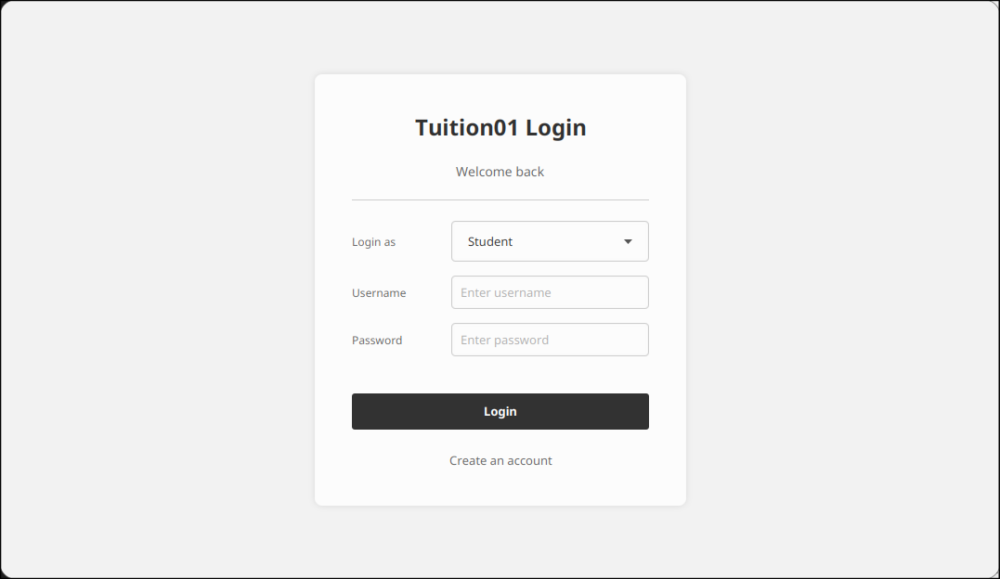

*Secure login portal for Students, Tutors, and Admins*


### Student Dashboard

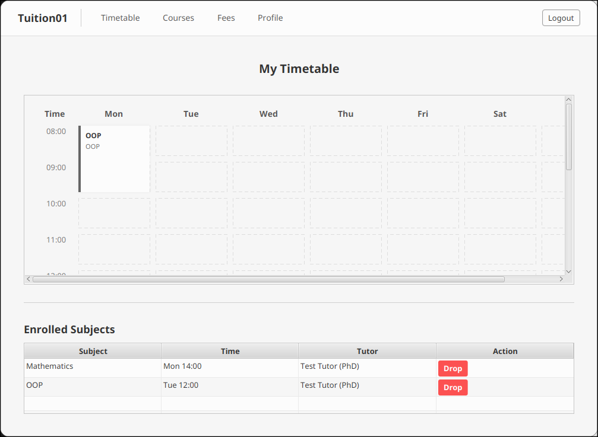

*Weekly schedule view with real-time "Drop Subject" functionality.*


*Course catalog for browsing subjects and managing enrollment requests.*


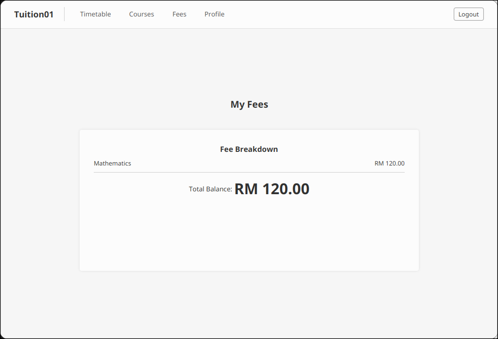

*Transparent breakdown of monthly fees and total balance.*


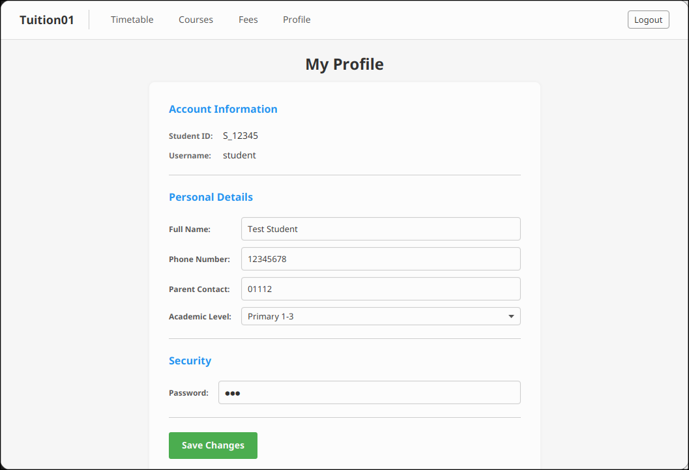

*Manage personal details and account security.*


### Tutor Dashboard

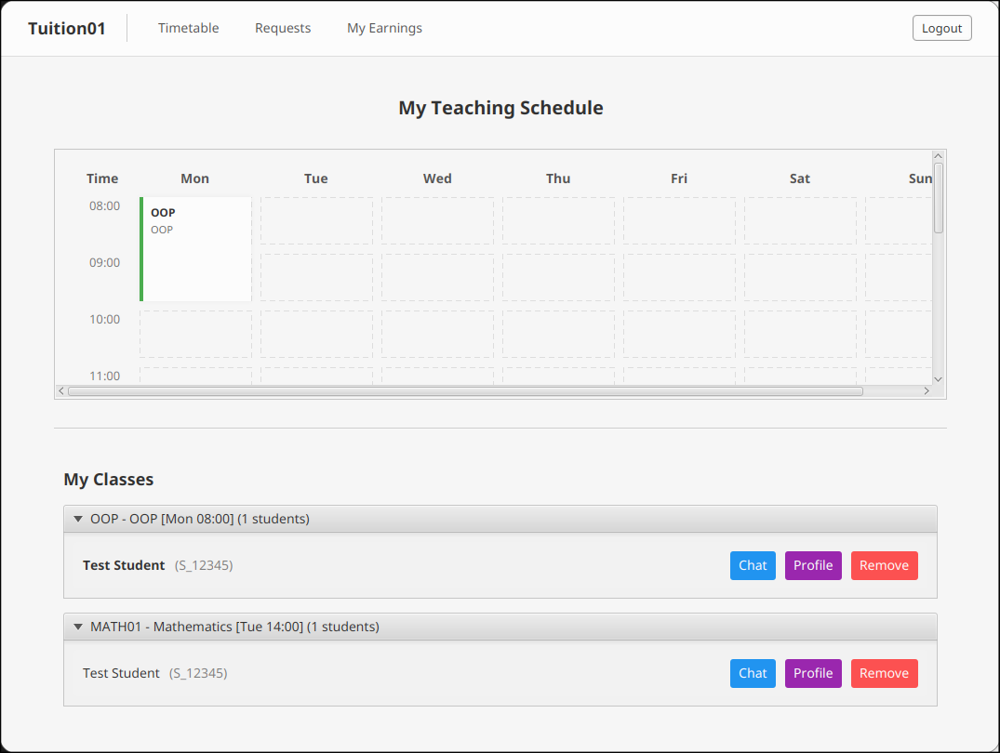

*Teaching schedule and "My Classes" list with student management options.*


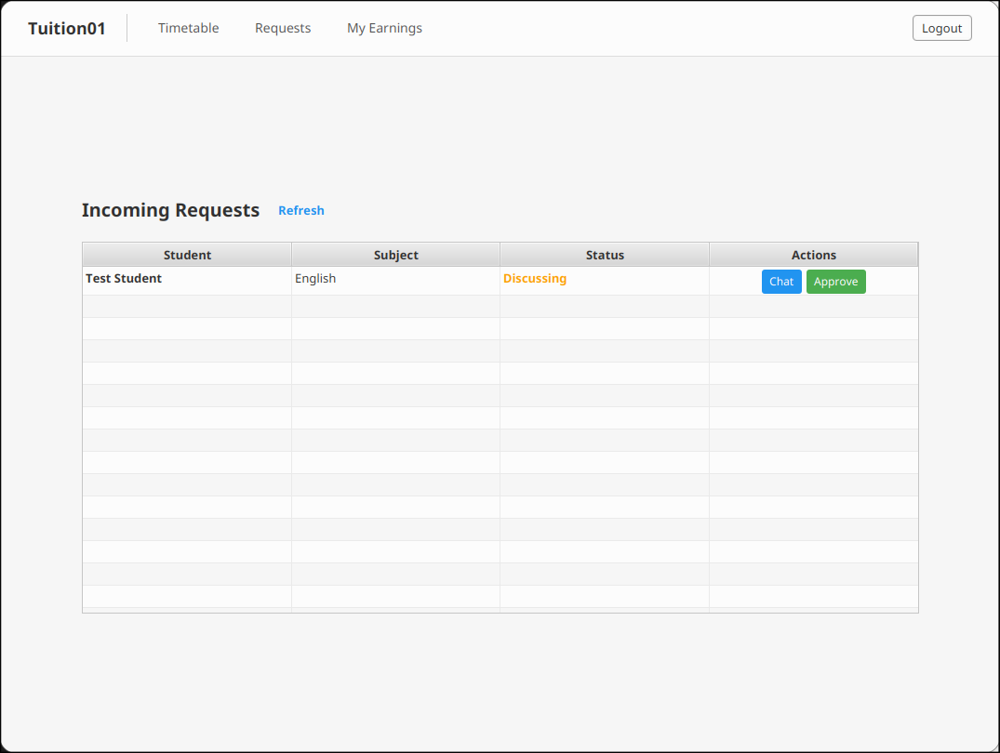

*Review and approve/reject incoming student enrollment requests.*


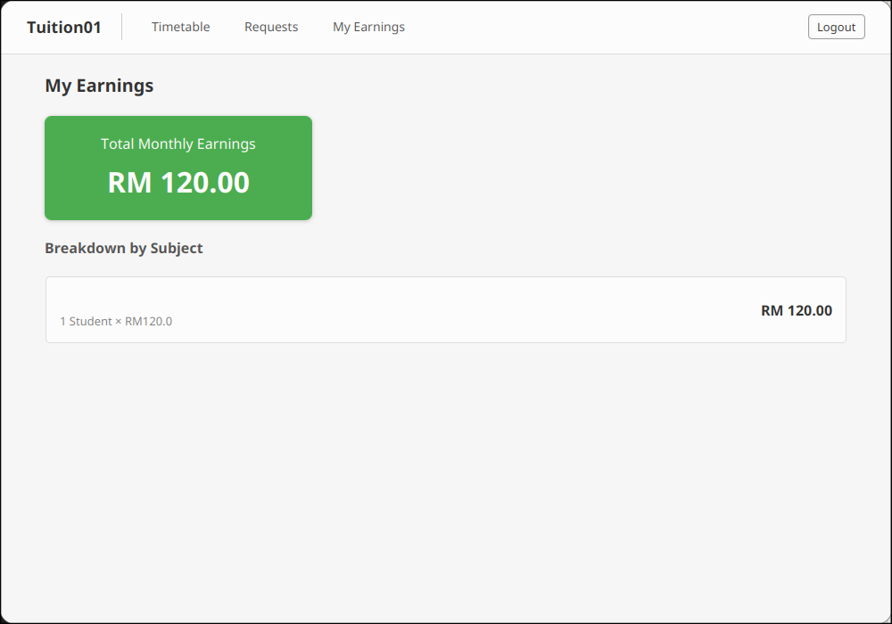

*Financial summary showing total monthly earnings and breakdown by subject.*


### Admin Dashboard

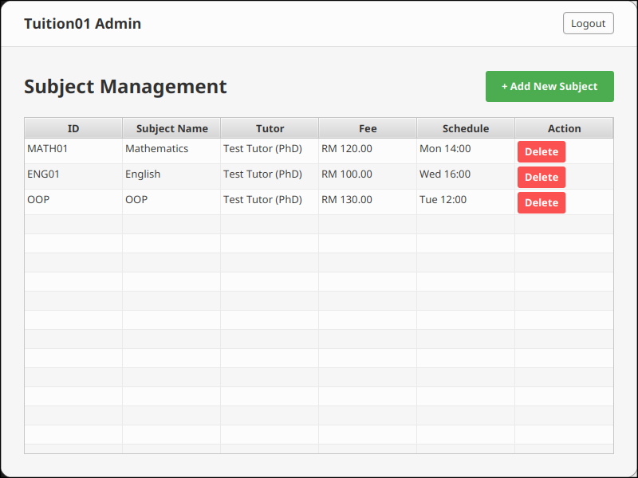

*Overview of system statistics and quick access to management tools.*

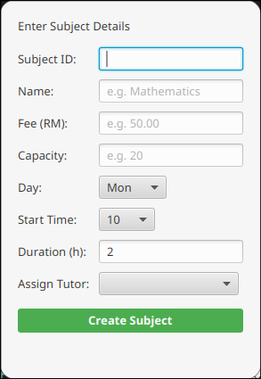


*Add, edit, or delete subjects and assign tutors.*

### Enrollment & Negotiation

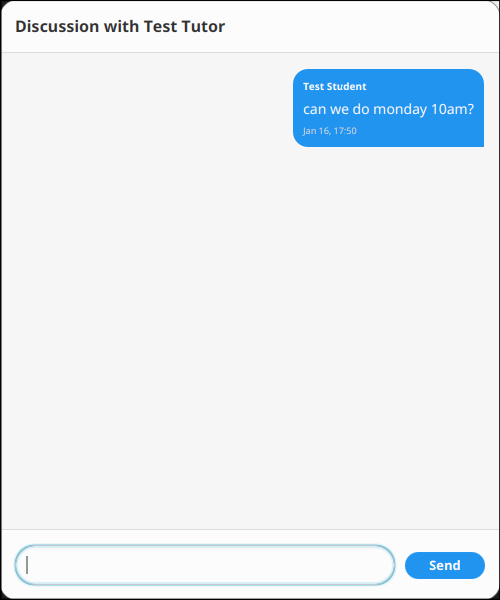


*Built-in chat allows students to negotiate class times with tutors before enrollment is finalized.*


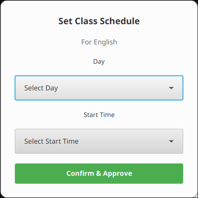


*Tutors can approve requests and customize the schedule (Day/Time) based on the negotiation.*


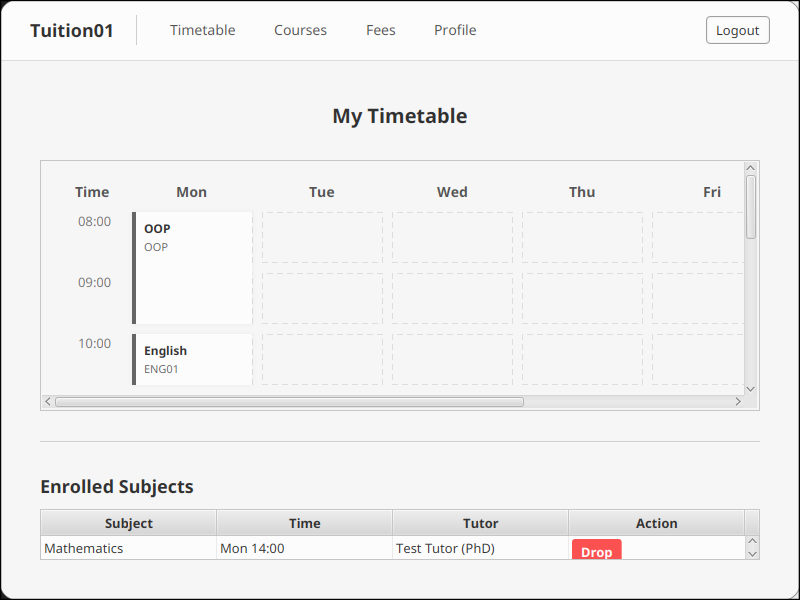
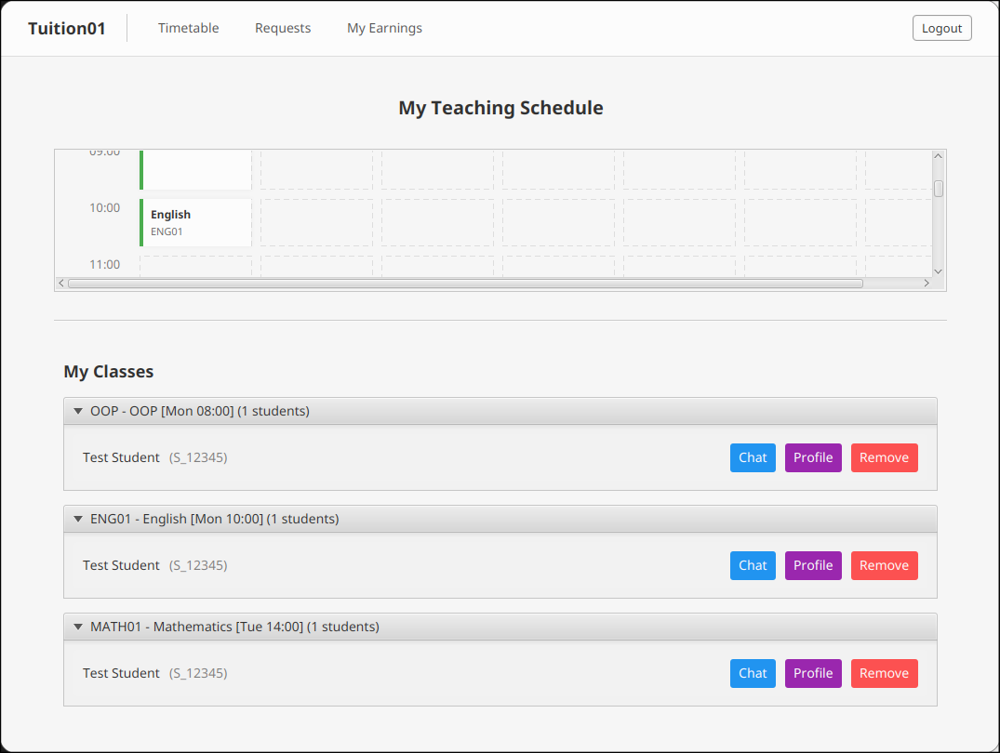

*Timetables for both Student and Tutor automatically update to reflect the **negotiated** time, not just the default subject schedule.*


> **Note**: Even though a subject has a default schedule listed, students can still request the subject and use the chat feature to negotiate a different time slot with the tutor.

### Core Classes

The system relies on the following key classes to manage data and logic:

* **`User`**: The base class for all system users, handling common attributes like ID, name, and password.
* **`Student`**: Extends `User`. Represents a student, storing academic level, parent contact, and enrollment history.
* **`Tutor`**: Extends `User`. Represents a tutor, managing their teaching subjects and schedule.
* **`Subject`**: Represents a tuition course, including details like subject name, fees, schedule (day/time), and tutor assignment.
* **`Enrollment`**: Links a `Student` to a `Subject`. Tracks the status of the request (e.g., Pending, Active, Rejected) and handles fee calculations.
* **`Timetable`**: Manages the logic for scheduling and displaying classes in a grid format, ensuring no time conflicts occur.

### Data Management
#### `users.json`

Stores student and tutor profiles.

```json
[
  {
    "userId": "S_12345",
    "username": "student",
    "role": "Student",
    "level": "Primary 1-3",
    "name": "Test Student"
  },
  {
    "userId": "T_001",
    "username": "tutor",
    "role": "Tutor",
    "qualification": "PhD",
    "name": "Test Tutor"
  }
]
```

#### `subjects.json`

Defines available tuition courses.

```json
[
  {
    "id": "MATH01",
    "name": "Mathematics",
    "fee": 120.0,
    "day": 1,
    "start": 14,
    "duration": 2,
    "tutorId": "T_001"
  }
]
```

#### `enrollments.json`

Tracks student-subject relationships and status.

```json
[
  {
    "enrollmentID": "ENR3",
    "studentId": "S_12345",
    "subjectId": "MATH01",
    "status": "Approved",
    "day": 2,
    "start": 14,
    "duration": 2
  }
]
```

#### `messages.json`

Stores chat history for negotiation.

```json
[
  {
    "enrollmentId": "ENR1",
    "senderId": "S_12345",
    "content": "Can I join?",
    "timestamp": "2026-01-14 01:37:10"
  }
]
```

#### (`DataManager.java`)

The `DataManager` handles all the saving and loading of data.

* **`loadAllData()`**: Reads all the JSON files when the app starts.
* **`saveUser()` / `updateUser()`**: Saves new students/tutors or updates their profiles.
* **`saveEnrollment()`**: Saves a new class request from a student.
* **`checkTimeConflict()`**: Checks if a student is already busy at a specific time before allowing them to join a class.
* **`calculateTotalFees()`**: Adds up the monthly fees for all approved classes for a student.


----

# Assignment 2 - Iman 2428591 (tuition01/gui/)

Please note this report is only for assignment 2 which is the GUI part, only within the /gui/ folder.

### Reflections

I succesfully made the login ui for our system and for now i only put Tuition01 as the name, also only students login is accepted and the main screen ui
is the timetable. What i find dificult the most is the styling , thats why i also uploaded the no styling version on my github repo.
I also uses only 2 .json files as simple database for login credentials and timetable details, so users can edit the files themselves and view the changes directly and easily. 


### Screenshots

### Login
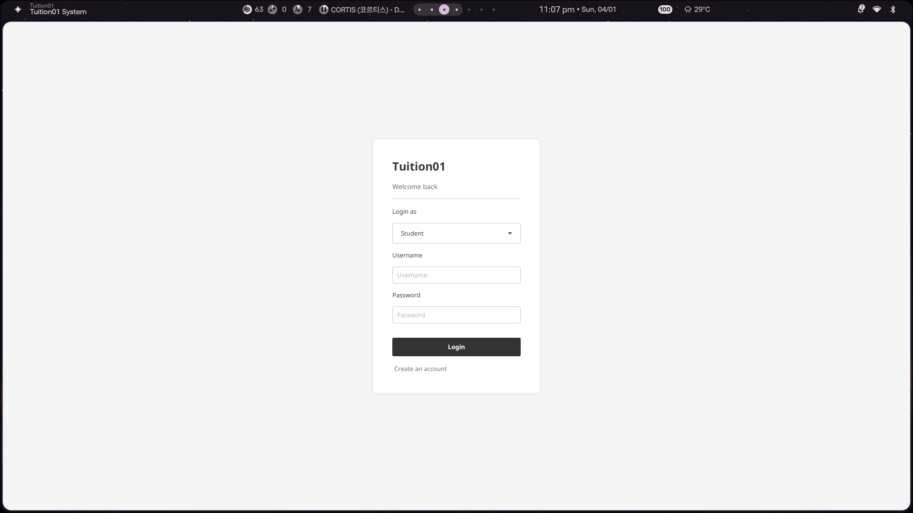

### Timetable
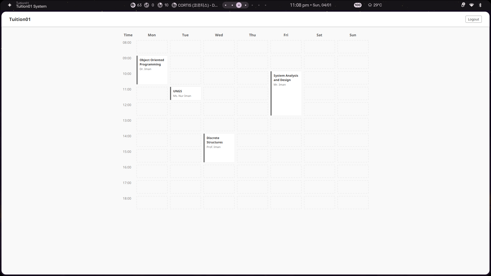

### .json

[users](gui/users.json)
```
[
  {
    "username": "student",
    "password": "123",
    "role": "student"
  },
  {
    "username": "tutor",
    "password": "123",
    "role": "tutor"
  }
]
```

[timetable](gui/timetable.json)
```
[
  { "day": 1, "startHour": 9, "duration": 2, "subject": "Object Oriented Programming", "tutor": "Dr. Iman" },
  { "day": 3, "startHour": 14, "duration": 2, "subject": "Discrete Structures", "tutor": "Prof. Iman" },
  { "day": 5, "startHour": 10, "duration": 3, "subject": "System Analysis and Design", "tutor": "Mr. Iman" },
  { "day": 2, "startHour": 11, "duration": 1, "subject": "UNGS", "tutor": "Ms. Nur Iman" }
]
```
